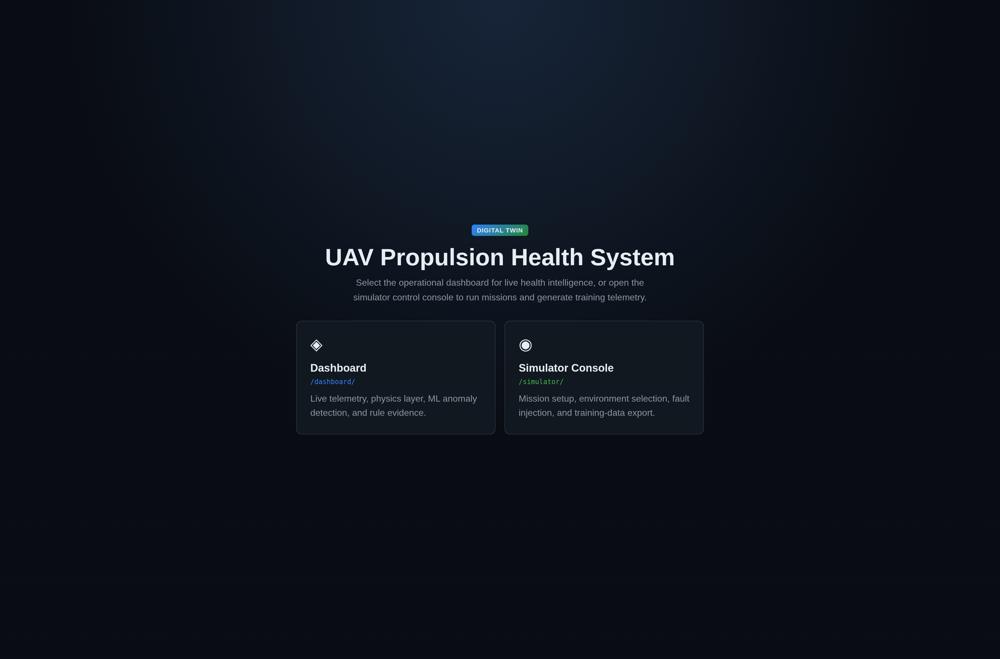
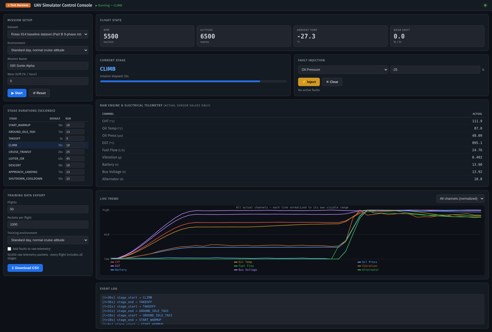
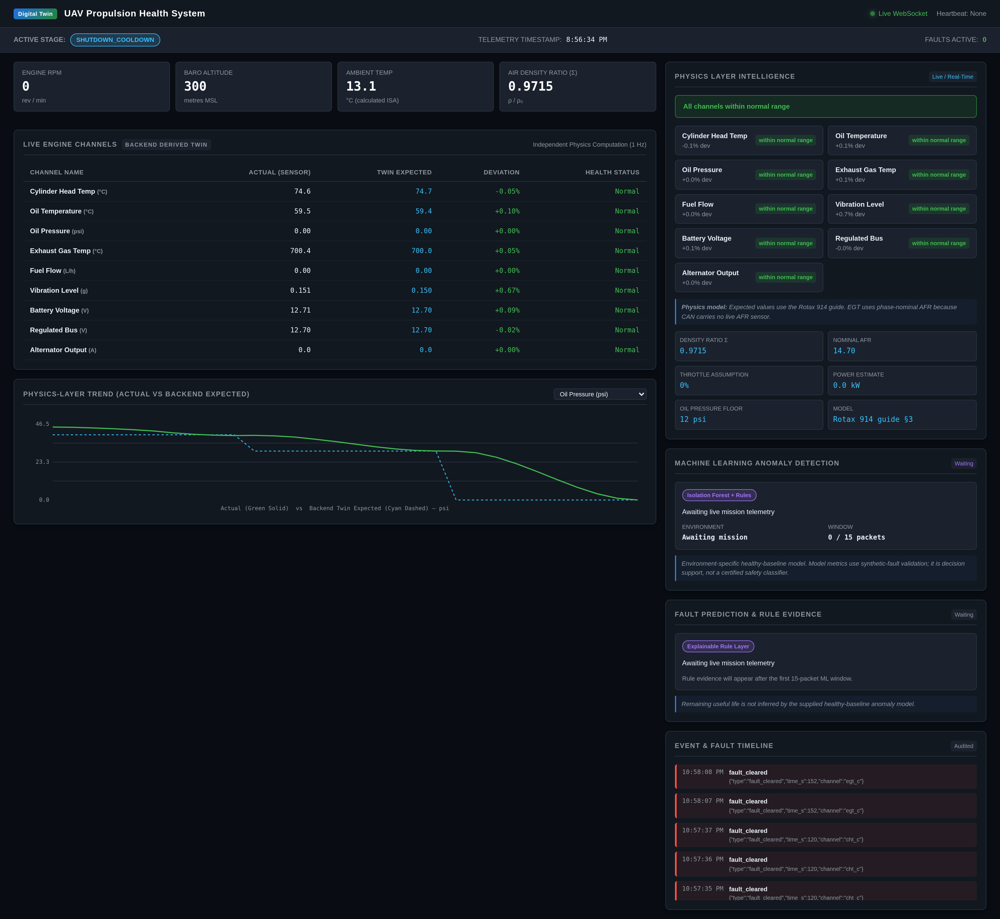

# UAV Propulsion Health System

This documentation describes the UAV Digital Twin project: a Rotax 914 mission simulator, encrypted virtual CAN transport, independent physics-based digital twin, live dashboard, PostgreSQL event store, and ML anomaly detection layer.

## Screenshots

Add these three real project screenshots to `docs/images/` so they render on GitHub:







The expected names and capture instructions are in [docs/images/README.md](docs/images/README.md).

## Start Here

| Document | Covers |
| --- | --- |
| [Architecture](docs/architecture.md) | Services, data flow, raw-vs-expected separation, routes. |
| [Simulator](docs/simulator.md) | Mission stages, environments, faults, and training export. |
| [Dashboard](docs/dashboard.md) | Physics view, WebSocket feed, ML status, and rule evidence. |
| [ML model](docs/ml-model.md) | Isolation Forest, rules, input contract, limitations. |
| [Dataset](docs/datasets.md) | Environments, telemetry schema, and generated CSVs. |
| [API](docs/api.md) | REST and WebSocket endpoints. |
| [Deployment](docs/deployment.md) | Local Docker and AWS EC2 deployment. |
| [Troubleshooting](docs/troubleshooting.md) | Heartbeat, CAN, Nginx, and ML diagnostics. |

## System Summary

```text
Simulator Console -> Simulator API -> encrypted CAN on vcan0 -> Backend
                                                               |-> PostgreSQL
                                                               |-> Physics layer
                                                               |-> ML/rule layer
Landing page <- Nginx <- Dashboard <- WebSocket <--------------+
```

The simulator sends raw sensor values only. The backend calculates expected values independently, then produces deviations and health states. This prevents the simulator from grading its own data.

## Quick Start

```bash
cp .env.example .env
sudo ./deploy/setup_vcan.sh
docker compose up -d --build
```

Open `http://localhost:8080/`, then choose **Dashboard** or **Simulator Console**.

## Safety Notice

The model learns a healthy baseline. Its fault evaluation uses synthetic injections and is decision support only; it is not certified for safety-critical or autonomous control.
