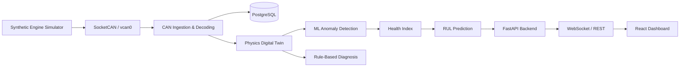

# UAV Engine Digital Twin

This project is a prototype demonstration of a MALE UAV piston-engine digital twin built around a synthetic CAN pipeline, PostgreSQL storage, a physics model, ML anomaly detection, rule-based diagnosis, health scoring, and RUL estimation.

## Overview

The system demonstrates the complete flow:

Synthetic Engine / Mission Simulator -> SocketCAN / vcan0 -> CAN ingestion -> PostgreSQL -> Physics -> ML -> Rules -> Health Index -> RUL -> FastAPI -> WebSocket -> React dashboard.

## Important engineering note

This project is intentionally a prototype/demonstrator. It relies on synthetic telemetry and stated engineering assumptions. The physics model, fault signatures, health index weighting, and RUL training are not OEM-certified and should be recalibrated against real engine fleet data before deployment.

## Architecture



## Mission phases

- POWER ON: 0-2 min
- PREFLIGHT CHECK: 2-5 min
- TAKEOFF: 5-6 min
- CLIMB: 6-14 min
- CRUISE / ISR: 14-54 min
- DESCEND: 54-59 min
- LAND: 59-60 min

## CAN signal set

The DBC file is the authoritative source for signal naming. Canonical names:

- rpm
- cht_c
- egt_c
- oil_pressure_kpa
- oil_temperature_c
- fuel_flow_lph
- vibration_mms
- afr
- battery_voltage
- altitude_m
- ambient_temp_c

## Physics model

The atmosphere model uses the prototype simplification:

- ambient temperature: $T(h) = T_0 - 0.0065h$
- density ratio: $\sigma = (1 - 2.2558e-5 \cdot altitude_m)^{4.2559}$

These constants are stated assumptions for the prototype and are kept centralized in `physics/config.py`.

## ML model

The anomaly detector uses an Isolation Forest trained only on healthy synthetic telemetry. It is persisted to `ml/models` and loaded at runtime without retraining on every startup.

## Rule-based diagnosis

The rules operate only when the ML layer has marked a sample as anomalous. Physics-derived deviations are treated as the primary driver for root-cause classification.

## Health Index

The health index is defined as a prototype composite model:

- mean absolute deviation from expected values
- anomaly score penalty
- final score capped at 0-100

The weighting constants are intentionally stored in `physics/config.py`.

## RUL methodology

The RUL pipeline uses synthetic degradation missions and a RandomForestRegressor. Predictions are generated from historical DB points and persisted to `rul_predictions`.

## Database schema

The project uses PostgreSQL with tables:

- mission_runs
- raw_telemetry
- computed_metrics
- fault_events
- rul_predictions

## Run

```bash
cp .env.example .env
docker compose up --build
```

Then open http://localhost:3000.

## Training models manually

```bash
python -m ml.train
python -m rul.train
```

## Tests

```bash
pytest -q
```

## Known limitations

- Synthetic telemetry only
- Prototype physics and RUL assumptions
- No certified OEM engine calibration
- Not suitable for real flight-critical operations without calibration against measured engine data

## Future deployment architecture

This project is a single-host demonstrator. A future production architecture would replace the synthetic engine with real ECU/CAN interfaces, add measured engine calibration and validation, and tighten the digital-twin models against real flight data.

## Replacing vcan0 with can0

If the hardware exposes a real CAN bus instead of a virtual interface:

- set `CAN_INTERFACE=can0`
- ensure the host Linux interface is present
- update `docker-compose.yml` networking as needed
- verify `ip link show can0` before starting the simulator
