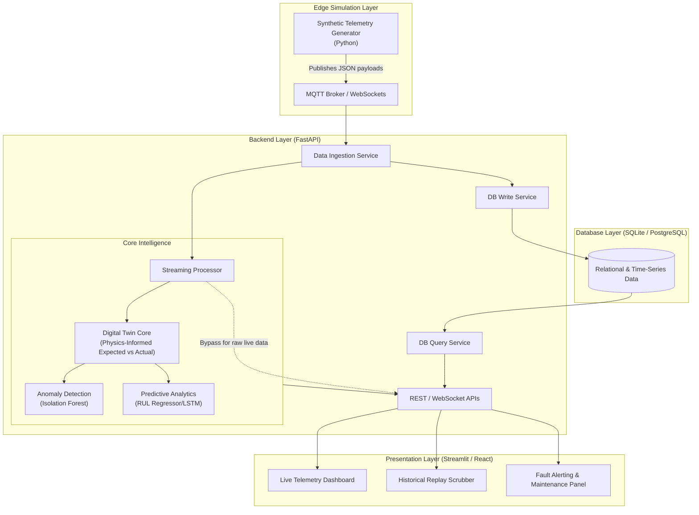
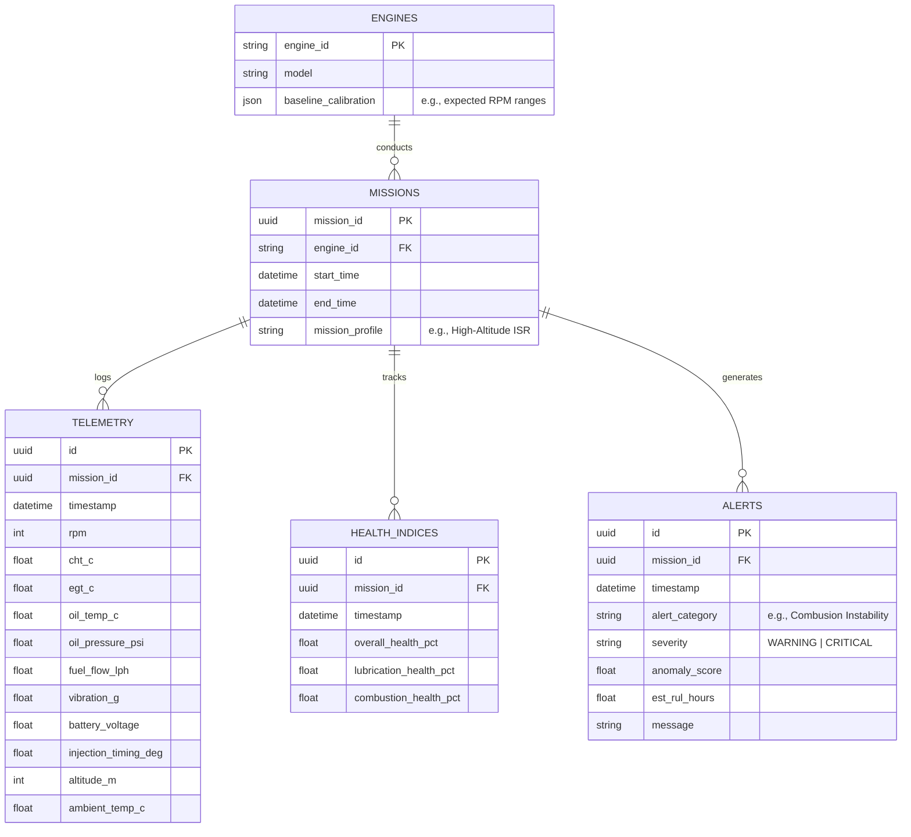
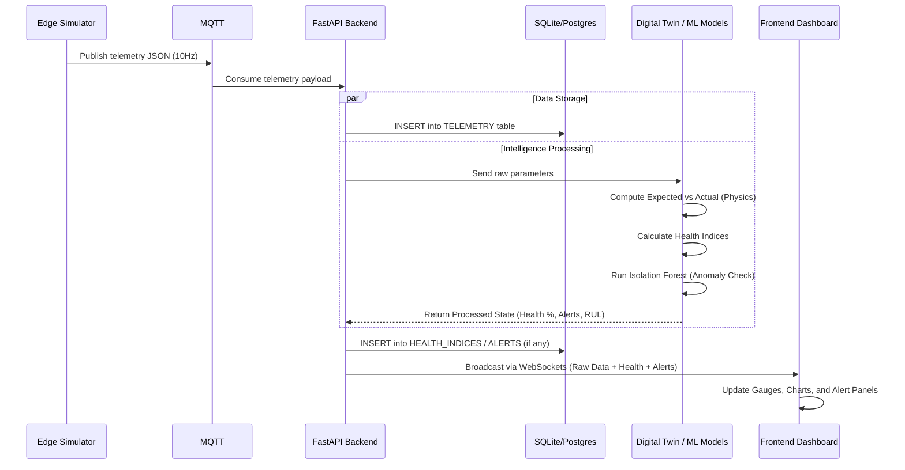

# Detailed System Architecture
**AI-Enabled Real-Time Digital Twin System for UAV Piston Engines**

This document provides a comprehensive architectural breakdown of the Digital Twin system, integrating the Data/ML, Backend, and Frontend layers, along with a detailed Database schema design.

---

## 1. High-Level Architecture Overview

The system is designed as a modular, event-driven architecture that ingests high-frequency simulated engine telemetry, processes it through a physics-informed digital twin and machine learning models, stores historical data for replay, and streams insights to a real-time visualization dashboard.

---

## 2. Component Specifications

### 2.1. Edge Simulation Layer (ML/Data Team)
Since real flight data is classified/unavailable, a **Synthetic Telemetry Generator** simulates the engine.
- **Functionality:** Generates the 11 core parameters (RPM, CHT, EGT, Oil Pressure, etc.) based on baseline physics and environmental conditions (Altitude, Ambient Temp).
- **Fault Injection:** Capable of gradually injecting degradation patterns (e.g., slowly decaying oil pressure mimicking a leak).
- **Protocol:** Streams data via MQTT or WebSockets to the Backend.

### 2.2. Digital Twin Core & ML Layer (ML/Data Team)
This is the "brain" of the application, running synchronously or near-synchronously with the telemetry stream.
- **Physics-Informed Model:** Calculates expected values (e.g., expected CHT for a given RPM and Altitude) and compares them against actual incoming telemetry to compute **% Deviations**.
- **Health Indices:** Aggregates deviations into subsystem health scores (e.g., Lubrication Health: 85%).
- **Anomaly Detection (Isolation Forest):** Evaluates multi-dimensional parameter vectors to flag abnormal operating states, categorizing them into faults (e.g., Misfire, Sensor Drift).
- **RUL Prediction:** Analyzes the slope of degradation trends to estimate Remaining Useful Life in flight hours.

### 2.3. Backend API Layer (Backend Team)
Built on **FastAPI** for high concurrency and performance.
- **Ingestion:** Subscribes to the MQTT stream, formats the data, and triggers the Digital Twin logic.
- **WebSocket Hub:** Pushes processed telemetry, health scores, and critical fault alerts to the Frontend with millisecond latency.
- **REST APIs:** Exposes endpoints for fetching historical data (`/api/v1/missions/{id}/telemetry`), triggering simulations (`/api/v1/simulate`), and retrieving maintenance logs.

### 2.4. Presentation Layer (Frontend Team)
Built with **Streamlit (MVP)** migrating to **React**.
- **Live Dashboard:** Displays real-time gauges, raw parameter multi-line charts, and subsystem health progress bars.
- **Mission Replay:** A "Flight Recorder" interface allowing operators to scrub through past missions to review how a fault developed.
- **Alert Panel:** Prominent visual notifications (flashing indicators) when anomalies are detected, coupled with RUL maintenance recommendations.

---

## 3. Database Design

For the MVP, **SQLite** will be used for rapid prototyping, which will easily scale to **PostgreSQL** for final production. The schema handles both relational metadata (Engines, Missions) and time-series telemetry.

### 3.1. Entity-Relationship Diagram

### 3.2. Data Storage Strategy
- **Time-Series Optimization:** In PostgreSQL, the `TELEMETRY` and `HEALTH_INDICES` tables should ideally be partitioned by `mission_id` or date, with indexes heavily optimized on `(mission_id, timestamp)`.
- **Data Pruning:** Raw telemetry might be downsampled (e.g., averaging 10Hz data into 1Hz data) for historical storage, keeping only critical anomalies at full resolution.

---

## 4. Sequence of Operations (The Live Loop)

## 5. Deployment Architecture (Phase 6)
- **Containerization:** The entire stack will be containerized using Docker Compose.
  - `container-1`: Synthetic Data Generator
  - `container-2`: FastAPI Backend + ML Inference Engine
  - `container-3`: PostgreSQL Database
  - `container-4`: Frontend (React/Streamlit) UI
- **Scalability:** The FastAPI backend is stateless, allowing multiple workers to handle high-frequency telemetry ingestion if deployed across multiple UAVs in the future.
