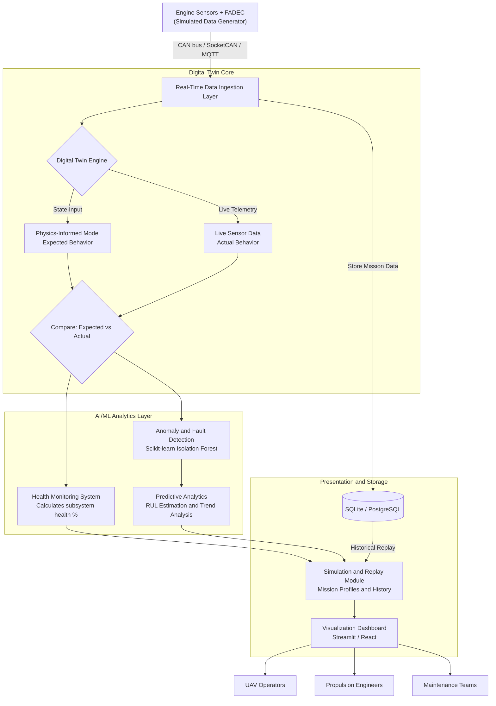
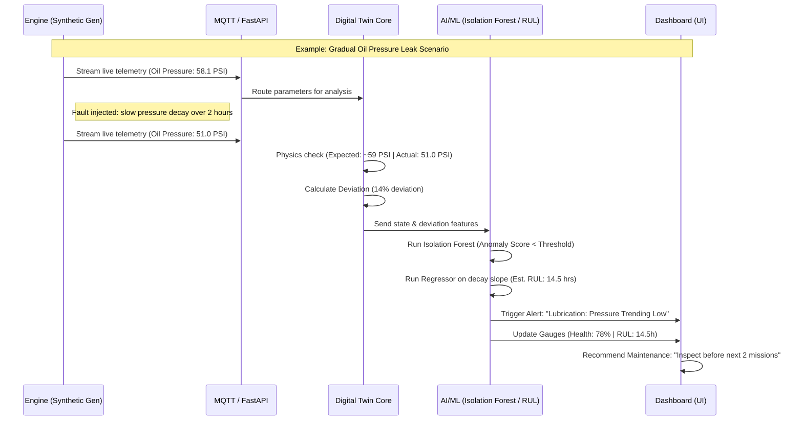

# AI-Enabled Real-Time Digital Twin System for UAV Piston Engines
**SIH 2026 — Problem Statement 54 (DRDO)**

## 1. Problem Summary
MALE (Medium Altitude Long Endurance) UAVs rely on piston engines for long-duration ISR, communication relay, maritime surveillance, and strategic defence missions. Engine failure in flight risks mission abort, asset loss, or unsafe recovery. Current UAV engine monitoring is threshold-based and reactive — it only flags failure after it's already happening, with no ability to predict Remaining Useful Life (RUL), track degradation trends, or simulate engine behavior under different missions/environments.

We are building a software Digital Twin system: a live virtual model of the engine, continuously synced with sensor data, that monitors health, predicts faults before they occur, and supports pre-flight simulation and post-flight replay.

---

## 2. Technology Stack

| Layer | Technology | Justification |
| ----- | ---------- | ------------- |
| **Core Language** | Python | Fast, modern, well-documented; standard for data handling and ML. |
| **Backend / API** | FastAPI | High-performance framework to serve twin data to the dashboard efficiently. |
| **Real-time Telemetry** | MQTT (paho-mqtt) / WebSockets | Standard lightweight protocols to simulate live sensor streaming. |
| **Data Handling** | Pandas, NumPy | Essential for structuring and generating synthetic time-series sensor data. |
| **Anomaly Detection** | Scikit-learn (Isolation Forest / One-Class SVM) | Proven approach for detecting abnormal patterns in time-series telemetry. |
| **RUL / Trend Prediction** | Scikit-learn regression, optionally LSTM (TensorFlow/PyTorch) | Standard techniques for time-series degradation and Remaining Useful Life prediction. |
| **Physics-Informed Layer** | Rule-based Python models | Hybrid thermodynamic + data-driven layer modeling expected behavior (e.g., expected oil temp per RPM/ambient temp). |
| **Database** | SQLite (Prototype) → PostgreSQL | Scalable storage for historic mission data used in replay capabilities. |
| **Dashboard** | Streamlit (MVP) / React + Chart.js (Final) | Streamlit for rapid Python-based prototyping; React for a polished, production-ready interface. |
| **Version Control** | Git + GitHub | Essential for team collaboration. |

---

## 3. Core Engine Parameters (The 11 Parameters)
*These parameters drive our engine health and performance baseline.*

1. **RPM (Revolutions Per Minute):** Baseline driver; everything scales against this.
2. **CHT (Cylinder Head Temperature):** Single most-watched health parameter.
3. **EGT (Exhaust Gas Temperature):** Used to infer mixture and combustion quality.
4. **Oil Pressure:** Monitors lubrication system health.
5. **Oil Temperature:** Reflects engine heat and lubrication efficiency.
6. **Fuel Flow:** Rate of fuel consumption, tied to RPM/power settings.
7. **Vibration Signatures:** Earliest warning sign of mechanical faults before temp/pressure shifts.
8. **Battery/Alternator Health:** Electrical system status; critical for sensors/FADEC.
9. **Injection Timing Parameters:** Fuel injection precision; affects combustion efficiency.
10. **Altitude:** Environmental context affecting physics calculations.
11. **Ambient Temperature:** Environmental context baseline.

---

## 4. System Architecture

---

## 5. End-to-End Fault Detection Flow

---

## 6. Phase-Wise Build Plan (MVP → Final Product)

### **Phase 0: Foundation (Week 1)**
- Finalize system architecture and repository setup.
- Assign roles: Data/Sim, ML/Anomaly, Backend, Dashboard, Research/Docs.
- Define exact sensor parameter schema and normal/abnormal bounds based on standard aviation references.

### **Phase 1: MVP - Synthetic Data & Basic Monitoring (Weeks 2-3)**
- **Data:** Build synthetic sensor data generator (healthy state + injected degradation patterns).
- **Backend:** Basic FastAPI endpoints to serve simulated readings and SQLite integration for storage.
- **Frontend:** Barebones Streamlit dashboard showing raw parameters in real-time.
- **Goal:** End-to-end data pipeline functional.

### **Phase 2: Digital Twin Core & Health Monitoring (Weeks 4-5)**
- **Physics Layer:** Build "expected behavior" virtual model (e.g., expected CHT based on RPM/altitude).
- **Comparison Engine:** Compare live telemetry against expected baselines.
- **Health Index:** Generate aggregated health percentages per subsystem (e.g., Lubrication, Combustion).
- **Goal:** Dashboard displays contextual health status, not just raw values.

### **Phase 3: Fault Detection & Analytics (Weeks 6-7)**
- **ML Layer:** Train Isolation Forest on synthetic healthy data.
- **Detection:** Identify deviations corresponding to misfires, leaks, sensor drift, and degradation.
- **Integration:** Surface categorized fault alerts to the dashboard with confidence levels.

### **Phase 4: Predictive Analytics - RUL (Weeks 8-9)**
- **ML Layer:** Build RUL (Remaining Useful Life) estimation models using regression/LSTM on degradation curves.
- **Analysis:** Implement trend analysis visualization.
- **Output:** Generate predictive maintenance recommendations based on rule thresholds.

### **Phase 5: Simulation & Replay Capabilities (Week 10)**
- **Simulator:** Develop mission-profile simulation (e.g., high-altitude ISR, hot-humid maritime).
- **Replay:** Implement historical data extraction for post-flight replay on the dashboard.
- **Goal:** Strong interactive features for judging and real-world mission prep.

### **Phase 6: Dashboard Polish & Documentation (Weeks 11-12)**
- **UI/UX:** Finalize real-time health dashboard, efficiency trends, and maintenance advisories.
- **Documentation:** Finalize technical docs, setup guides, and deployment roadmaps.
- **Demo:** End-to-end rehearsal simulating a fault from injection to maintenance recommendation.

---

## 7. Known Risks & Honest Scoping

- **Data Availability:** We rely on realistic simulated data since real DRDO classified engine data is unavailable. The architecture is explicitly designed to be recalibrated with operational data upon deployment.
- **Autonomy Scope:** The system provides **decision-support only**. RTL (Return to Land) logic recommends actions, but operator/GCS must confirm. Avoid claiming full autonomy to align with safety/certification standards.
- **Flexibility:** The solution is engine-agnostic. It uses a parameter mapping and threshold calibration approach, ensuring applicability across indigenous or imported UAV piston engines.
